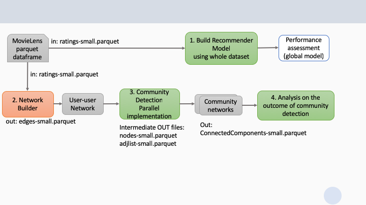

# CSC8101 2018-19 Coursework assignment

This is about building models for providing movie recommendations. 
We use the ALS algorithm (see lecture notes) with explicit movie ratings.
We use the entire movielens dataset. 

However, building the model out of the dataset is only one of the tasks. 
Please refer to the figure below.

We note that we can create a user-user network from the user-movie-ratings (U-M-R) matrix, i.e., where each user is represented by a node, and there is an edge between two users u1, u2 if u1 and u2 have rated the same movie. The *weight* of the edge is the number of the same movies that have both rated. Note that for simplicity here we ignore the values of the ratings. 
Once we have the network, it makes sense to partition it into communities of users, so that users who have rated many of the same movies will likely belong to the same community.

At this point, we build one recommender model using the same ALS approach, but *separately for each community*.
The exercise ends with a comparison of the performance of the global model relative to the smaller community models. 
is it true that the models that only consider users within a community perform better for that community than the global model?

All programming is in Python for Spark and occurs using Databricks notebooks, attached to the shared Spark cluster provided for the module.

Details of each of the tasks are given below.

## The MovieLens dataset
The original datasets are [here](https://grouplens.org/datasets/movielens/).

The dataset comes in two sizes:
- small, for code debugging purposes. Download and inspect from [here](data/ml-latest-small.zip).
   this contains 100,000 ratings applied to 9,000 movies by 600 users. Last updated 9/2018.
- large, for testing your actual models: 20 million ratings applied to 27,000 movies by 138,000 users. 
   This has been upoloaded to the cluster data store for you.
   
You will be using only one of the files in the dataset: **ratings.csv**.  The large version on the cluster has been stored as a parquet file, a binary format for Spark dataframes that is much faster to load than csv.

## Repository File Structure

`./data` : contains an example edge file for experimenting purpose.  
`./dist` : contains the `Comscan` wheel file.  
`./notebooks` : examples on how to use the library.  
`./references` : references to implemented algorithms.   
`./src` : the source code for `Comscan` library.  

## Prerequisite Packages

Packages|Version
---|---
networkx|2.2.0
matplotlib|>=3.0.1
pyspark|=2.3.0
pandas|>=0.23.0

## Installation

`pip install ./dist/comscan-0.0.1-py3-none-any.whl`

## Data Structures

### Sequential

**Graph**

List of edges. It is loaded in memory as an adjacency list.

    [(source_node, target_node, weight)]
    
    source,target,weight
    1,6,1
    1,8,1
    2,3,1
    2,4,1

**Paths**

    {target: [path]}
    path = [node]

    {1: [[1]], 2: [[1, 2], [1, 3, 2]], 3: [[1, 3]], 4: [[1, 2, 4], [1, 3, 2, 4]], 5: [[1, 2, 4, 5], [1, 3, 2, 4, 5]], 6: [[1, 2, 4, 6], [1, 3, 2, 4, 6], [1, 2, 4, 5, 6], [1, 3, 2, 4, 5, 6], [1, 2, 4, 7, 6], [1, 3, 2, 4, 7, 6]], 7: [[1, 2, 4, 7], [1, 3, 2, 4, 7]], 8: []}

**Edges count map**:

contains count of shortest paths to this target through this edge
 
    {target: {edge: edge_count}}
    
    {1: {}, 2: {(1, 2): 1.0, (3, 2): 1.0, (1, 3): 1.0}, 3: {(1, 3): 1.0}, 4: {(1, 2): 1.0, (3, 2): 1.0, (1, 3): 1.0, (2, 4): 2.0}, 5: {(1, 2): 1.0, (4, 5): 2.0, (3, 2): 1.0, (1, 3): 1.0, (2, 4): 2.0}, 6: {(1, 2): 3.0, (5, 6): 2.0, (3, 2): 3.0, (1, 3): 3.0, (4, 6): 2.0, (4, 5): 2.0, (7, 6): 2.0, (2, 4): 6.0, (4, 7): 2.0}, 7: {(1, 2): 1.0, (4, 7): 2.0, (1, 3): 1.0, (3, 2): 1.0, (2, 4): 2.0}, 8: {}}

Obtained from:
- paths

**Path count map**:

    {target: path_count}
    
    {1: 1, 2: 2, 3: 1, 4: 2, 5: 2, 6: 6, 7: 2, 8: 0}

Calculated from:
- paths 

**Betweenness**:

Dictionary of edges and betweenness value (float)

    {egdge: betweennes_value}
    
    {(1, 2): 2.5, (5, 6): 0.3333333333333333, (4, 7): 1.3333333333333333, (1, 3): 3.5, (2, 3): 2.5, (4, 6): 0.3333333333333333, (4, 5): 1.3333333333333333, (6, 7): 0.3333333333333333, (2, 4): 4.0}

It is calculated iteratively for each source:
- path_count_map (single source)
- edges_count_map (single source)

**Communities**:

Set of node ids

    {node}
    {1,2,3} 

**Components**:

Tuple of communities

    (community)
    ({1, 2, 3}, {4, 6}, {5}, {7}, {8})

### Distributed

**Nodes RDD**

List of nodes.

    [node]
    
    [1, 6, 8, 2, 3]

**Graph Broadcast**

Spark Broadcast variable with Graph object

**Shortest Paths RDD**

    shortest_paths_rdd -> [(source, paths)]
    paths -> {target: [shortest_path]}
    shortest_path -> [node]
    source -> int
    target -> int
    node -> int

    [(1,
      {
       1: [[1]],
       2: [[1, 6, 2], [1, 8, 2]],
       3: [[1, 6, 2, 3], [1, 8, 2, 3], [1, 6, 4, 3]],
       4: [[1, 6, 4]],
       5: [[1, 6, 2, 5], [1, 8, 2, 5], [1, 8, 7, 5]]
      }
     )
    ]

**Edges Count RDD**

Contains count of shortests paths that goes through each edge 

    edges_count_rdd -> [((source, target), (edge, edge_count))]
    (source, target): define the nodes for shortest path computation, i.e. this is not an edge
    edge -> (u, v)
    edge_count -> number of shortest paths between 'source' and 'target' that goes through 'edge'

    [
     ((1, 2), ((2, 8), 1.0)),
     ((1, 2), ((1, 8), 1.0)),
     ((1, 2), ((2, 6), 1.0)),
     ((1, 2), ((1, 6), 1.0)),
     ((1, 3), ((1, 8), 1.0))
    ]

**Paths Count RDD**

Contains the number of shortest paths between two nodes

    path_count_rdd -> [(source, target), paths_count]

    [
      ((1, 1), 1), 
      ((1, 2), 2), 
      ((1, 3), 3), 
      ((1, 4), 1), 
      ((1, 5), 3)
    ]

**Edge Betweenness RDD**

    edge_betweenness_rdd -> [(edge, betweenness)]
    edge -> (u,v)
    betweenness -> float

    [
      ((2, 8), 69.9047619047619),
      ((6, 12), 191.4793650793651),
      ((11, 15), 106.36190476190477),
      ((5, 22), 135.8968253968254),
      ((13, 14), 45.63809523809524)
    ]

## Benchmark

Edges: 3000;		Target Level: 5;			Sequential Computing Time (seconds): 298.97922587394714 \
Edges: 1000;		Target Level: 5;			Distributed Computing Time (seconds): 78.53743696212769 \
Edges: 2000;		Target Level: 5;			Distributed Computing Time (seconds): 334.11402106285095 \
Edges: 2000;		Target Level: 5;			Sequential Computing Time (seconds): 112.116375207901 \
Edges: 1000;		Target Level: 5;			Sequential Computing Time (seconds): 25.027655601501465

## References

1. Girvan M. and Newman M. E. J., Community structure in social and biological networks, Proc. Natl. Acad. Sci. USA 99, 7821–7826 (2002).
2. Freeman, L., A Set of Measures of Centrality Based on Betweenness, Sociometry 40, 35–41  (1977).
3. E. W. Dijkstra, A note on two problems in connexion with graphs. Numerische Mathematik, 1:269–
271, (1959)
4. GitHub - networkx/networkx: Official NetworkX source code repository, https://github.com/networkx/networkx
5. Takács, G. and Tikk, D. (2012). Alternating least squares for personalized ranking. 
Proceedings of the sixth ACM conference on Recommender systems - RecSys '12. 
[online] Available at: https://www.researchgate.net/publication/254464370_Alternating_least_squares_for_personalized_ranking
