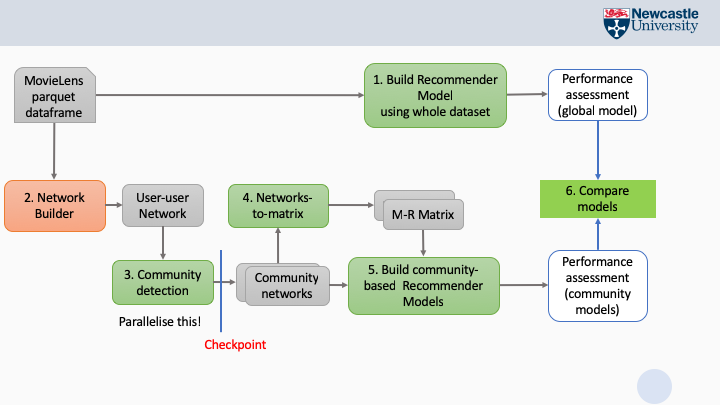

# CSC8101 2018-19 Coursework assignment

This is about building models for providing movie recommendations. 
We use the ALS algorithm (see lecture notes) with explicit movie ratings.
We use the entire movielens dataset. 

However, building the model out of the dataset is only one of the tasks. 
Please refer to the figure below.

The second task is to create a user-user network from the user-movie-ratings (U-M-R) matrix from the movielens dataset, i.e., where each user is represented by a node, and there is an edge between two users u1, u2 if u1 and u2 have rated the same movie. The *weight* of the edge is the number of the same movies that have both rated. Note that for simplicity here we ignore the values of the ratings. 
Once we have the network, you will partition it into communities of users, so that users who have rated many of the same movies will likely belong to the same community.
You will implement a distributed version of the well-known Girwan-Newman (GN) algorithm for community detecteion, using a library for computing SSSP (single-source-shortest-path). The SSSP algorithm is sequential but you should do your best to parallelise the multiple invocations that are required to realise GN.

The exercise ends with an analysis of the communities found in the previous step. You may be required to run the same algorithm on a different dataset to see the differences. Please see specific instructions in the template notebooks. 

All programming is in Python for Spark and occurs using Databricks notebooks, attached to the shared Spark cluster provided for the module.

Details of each of the tasks are given below.

## The MovieLens dataset
The original datasets are [here](https://grouplens.org/datasets/movielens/).

The dataset comes in two sizes:
- small, for code debugging purposes. Download and inspect from [here](data/ml-latest-small.zip).
   this contains 100,000 ratings applied to 9,000 movies by 600 users. Last updated 9/2018.
- large, for testing your actual models: 20 million ratings applied to 27,000 movies by 138,000 users. 
   This has been uploaded to the cluster data store for you.
   
You will be using only one of the files in the dataset: **ratings.csv**.  The large version on the cluster has been stored as a parquet file, a binary format for Spark dataframes that is much faster to load than csv.

## Task 1: build a global recommendation model

- Start from the **task1** notebook provided (including loading  **ratings.paquet** into a dataframe
- train a recommender model using the ALS approach. You may refer to the example code on the [Spark doc for Collaborative Filtering](https://spark.apache.org/docs/latest/ml-collaborative-filtering.html). However be aware that the input data format may be different
- after you build the model, you need to add code to automatically optimise the *rank* hyperparameter, usiong RMSE as your performance metric. Report your best results in the notebook.

## Task 2: Build the user-user network.

instructions: see notebook: **task2-template**

## Task 3: Community detection.

This task requires you to implement a version of the Girwan-Newman algorithm that is optimised to make use of multiple workers on the Spark clsuter.

You are given a python module that operates on the graoh structure you generated in Task 2, and implements a number of functions to get you started.

Using these methods, you will implement a version of GN that includes MapReduce patterns to *parallelise execution on the entire graph.*

instructions: see notebook: **task3-template**

## Task 4: Analysis of your community detection results.

can you try and provide some insight into why the community detection algorithm may not have performed as expected?
for this, you may want to go back to your raw and intermediate datasets and run some summary statistics and basic analytics:
for instance: is this a dense/sparse set of ratings? what is the average number of ratings per user? how are users connected in the user-user network?

## Details on of the Data Structures used in the assignment

**Graph**

This is a class you can import:

`from comscan.model.graph import Graph`

List of edges. It is loaded in memory as an adjacency list.

    [(source_node, target_node, weight)]
    
    source,target,weight
    1,6,1
    1,8,1
    2,3,1
    2,4,1

Note: in Task 4, each of your workers require a copy of the entire graph to compute on. You will need to use a `broadcast variable` to hold the graph instance

**Paths**

    {target: [path]}
    path = [node]

    {1: [[1]], 2: [[1, 2], [1, 3, 2]], 3: [[1, 3]], 4: [[1, 2, 4], [1, 3, 2, 4]], 5: [[1, 2, 4, 5], [1, 3, 2, 4, 5]], 6: [[1, 2, 4, 6], [1, 3, 2, 4, 6], [1, 2, 4, 5, 6], [1, 3, 2, 4, 5, 6], [1, 2, 4, 7, 6], [1, 3, 2, 4, 7, 6]], 7: [[1, 2, 4, 7], [1, 3, 2, 4, 7]], 8: []}

**Shortest Paths**

This RDD holds the result from an invocation of the SSSP algorithm:

    shortest_paths_rdd -> [(source, paths)]
    paths -> {target: [shortest_path]}
    shortest_path -> [node]
    source -> int
    target -> int
    node -> int

    [(1,
      {
       1: [[1]],
       2: [[1, 6, 2], [1, 8, 2]],
       3: [[1, 6, 2, 3], [1, 8, 2, 3], [1, 6, 4, 3]],
       4: [[1, 6, 4]],
       5: [[1, 6, 2, 5], [1, 8, 2, 5], [1, 8, 7, 5]]
      }
     )
    ]

**Betweenness**:

A  Dictionary of edges and their betweenness value (float) as generated based on one SSSP invocation, i.e., these will be _partial_ betweeness values

    {egdge: betweennes_value}
    
    {(1, 2): 2.5, (5, 6): 0.3333333333333333, (4, 7): 1.3333333333333333, (1, 3): 3.5, (2, 3): 2.5, (4, 6): 0.3333333333333333, (4, 5): 1.3333333333333333, (6, 7): 0.3333333333333333, (2, 4): 4.0}

**Communities**:

Set of node ids

    {node}
    {1,2,3} 

**Components**:

Each connected component in the graph is partitioned into communities. This is represented as:

    (community)
    ({1, 2, 3}, {4, 6}, {5}, {7}, {8})

## References

1. Girvan M. and Newman M. E. J., Community structure in social and biological networks, Proc. Natl. Acad. Sci. USA 99, 7821–7826 (2002).
2. Freeman, L., A Set of Measures of Centrality Based on Betweenness, Sociometry 40, 35–41  (1977).
3. E. W. Dijkstra, A note on two problems in connexion with graphs. Numerische Mathematik, 1:269–
271, (1959)
4. GitHub - networkx/networkx: Official NetworkX source code repository, https://github.com/networkx/networkx
5. Takács, G. and Tikk, D. (2012). Alternating least squares for personalized ranking. 
Proceedings of the sixth ACM conference on Recommender systems - RecSys '12. 
[online] Available at: https://www.researchgate.net/publication/254464370_Alternating_least_squares_for_personalized_ranking
